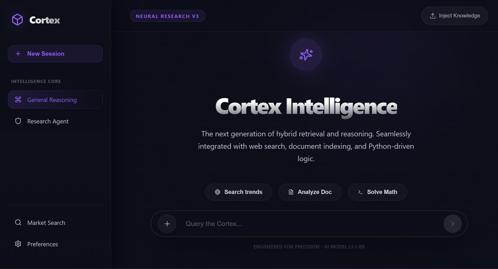
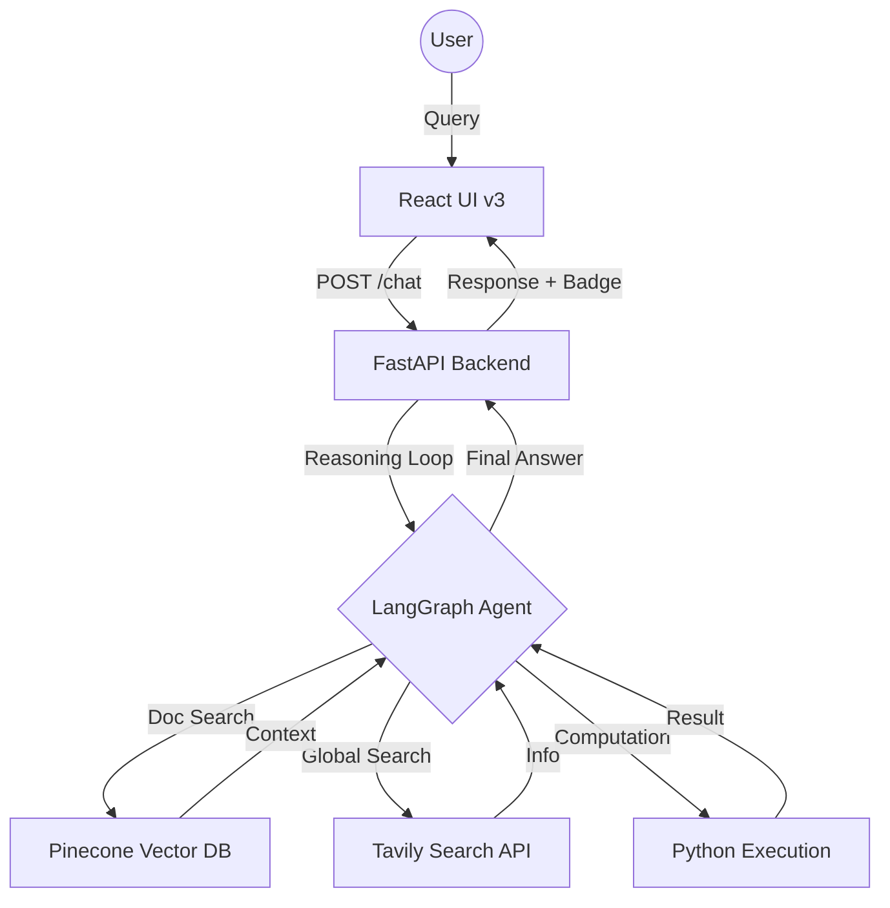

# CortexRAG - Premium Neural Interface for Hybrid Retrieval

CortexRAG is a high-depth, premium "Neural" assistant designed for advanced research, document indexing, and agentic reasoning. It combines the power of **LangGraph**, **Groq (Llama 3.1)**, and **Vector Search** with a sleek, modern interface optimized for precision and speed.



## 🌟 Features

- **Hybrid Intelligence**: Seamlessly switch between Internal Vector Search (RAG), Global Web Search, and Python-driven computations.
- **Premium Neural UI**: A high-depth interface featuring a floating pill console, acrylic glassmorphism, and smooth micro-animations.
- **Agentic Reasoning**: Powered by LangGraph's cyclical reasoning loop, allowing the assistant to browse, calculate, and retrieve autonomously.
- **Knowledge Injection**: Simple drag-and-drop or upload system to index PDFs and Text files into a Pinecone vector database.
- **Optimized for Low-TPM**: Built-in history trimming and rate-limit backoffs to ensure stability even on limited API tiers.

## 🛠️ Tech Stack

- **Frontend**: React, Vite, Lucide Icons, Vanilla CSS (Glassmorphism).
- **Backend**: FastAPI, LangChain, LangGraph.
- **LLM**: Groq (Llama 3.1 8B / 3.3 70B).
- **Database**: Pinecone (Vector Search).
- **Embeddings**: HuggingFace (Inference API).
- **Search**: Tavily AI.
- **Logic**: Python REPL.

## 📐 Architecture



## 🚀 Getting Started

### 1. Prerequisites
- Python 3.9+
- Node.js 18+
- API Keys for: [Groq](https://console.groq.com/), [Pinecone](https://www.pinecone.io/), [Tavily](https://tavily.com/), [HuggingFace](https://huggingface.co/).

### 2. Backend Setup
```bash
cd backend
python -m venv venv
source venv/bin/activate  # On Windows: .\venv\Scripts\activate
pip install -r requirements.txt
```

Create a `.env` file in the `backend/` directory:
```env
GROQ_API_KEY=your_key
TAVILY_API_KEY=your_key
PINECONE_API_KEY=your_key
HUGGINGFACEHUB_API_TOKEN=your_token
```

Run the server:
```bash
python app.py
```

### 3. Frontend Setup
```bash
cd frontend
npm install
npm run dev
```

The application will be available at `http://localhost:5173`.

## 🧠 Optimization Details

To handle the 6,000 TPM limit of some Groq tiers, CortexRAG implements:
- **Context Trimming**: Automatically maintains the last 8 messages of conversation.
- **Retry Logic**: Catches `RateLimitError` and implements a 6-second cooling period before auto-retrying.
- **JSON Enforcement**: Explicit system-level instructions to prevent Malformed Tool calls (XML leaks).

---
*Engineered for precision • Built with Cortex*
